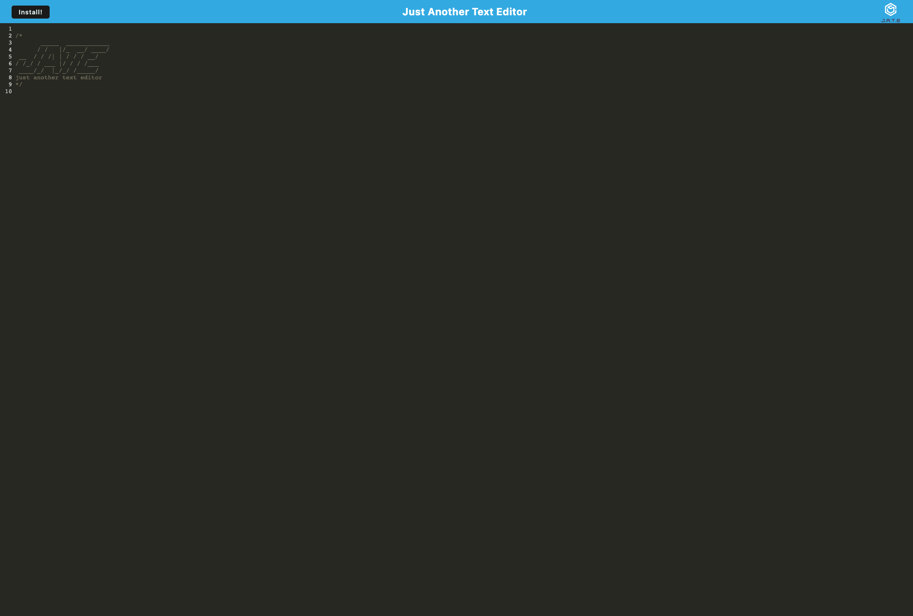

# PWA-text-editor

## Description
This is a text editor that is a progressive web application. By installing this application locally it can used offline. This application utilizes webpack to bundle modules, a workbox service worker to cache static assets, and indexedDB for its database.

### Table of contents
- [Screenshots](#Screenshots)
- [Installation](#Installation)
- [Usage](#Usage)
- [Links](#Links)
- [Contact](#Contact)

## Screenshots

## Installation

## Usage

## Links
[Heroku](https://yaris-jate.herokuapp.com/)

## Contact
[GitHub](https://github.com/FixieGemini)

[Email](yariel.crespo@gmail.com)